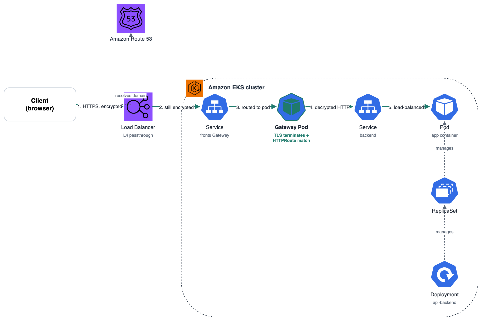
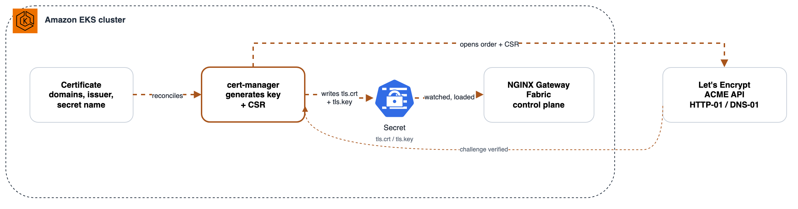

# Welcome

Welcome to my personal lab: an environment I built to put what I know as an engineer into practice. Think of it as my personal gym. At a high level, it's a website running on a Kubernetes cluster in AWS, and my goal is to build it using industry best practices and the lessons I've learned along the way.

## Lab 

The [Lab](https://github.com/RenayB/Lab) repo contains the project's Kubernetes resources (helm chart) and front end. Check it out for more details.

## Lab-Infrastructure

This repo holds the infrastructure and CI/CD that support the project, including the Terraform code and GitHub Actions pipelines that deploy its resources.

### Design 

The site runs on Amazon EKS, provisioned with Terraform. Each app is packaged as a small Helm chart, and delivery is GitOps-driven: ArgoCD watches the [Lab](https://github.com/RenayB/Lab)  repository and automatically syncs any changes to the cluster. Incoming traffic flows through a single shared Gateway, where Gateway API (implemented by NGINX Gateway Fabric) handles routing and TLS termination.

# Additional Notes 

This part of the README becomes very detailed and highlights some concpets for me to refer later on when needed. 

## Flows

## User Traffic Flow

1. The request to the website's domain resolves to its designated IP — in this case, the load balancer in front of the cluster, provisioned via the Gateway resource.
2. The load balancer receives the request and forwards the still-encrypted traffic to the Service fronting the Gateway.
3. TLS termination takes place in the Gateway's data plane pod. The handshake happens directly with the client here — key exchange, presentation and verification of the certificate, and establishment of the encrypted session.
4. NGINX now holds the decrypted HTTP request. It uses this to evaluate the matching HTTPRoute resource, which determines which backend Service — and ultimately which Deployment's pods — the request gets forwarded to.

## Certificate Flow

1. Independently of any client request — this runs ahead of time, on its own schedule — cert-manager creates a Certificate resource specifying the DNS names, which issuer to use (the Let's Encrypt endpoint), and which Secret to write the results into (private key and tls.crt).
2. cert-manager generates a private key and a CertificateRequest resource (containing the CSR built from that key).
3. cert-manager's ACME issuer talks to Let's Encrypt's ACME API. Let's Encrypt issues a challenge per domain to prove you control it — either HTTP-01 or DNS-01.
4. Once the challenge is verified, cert-manager retrieves the issued certificate from Let's Encrypt and stores the cert and key inside a Kubernetes Secret.
5. NGINX Gateway Fabric's control plane picks up that Secret and loads it into the data plane — this is the certificate that's ready and waiting when a real client's TLS handshake (step 3 of the User Traffic Flow above) happens.

